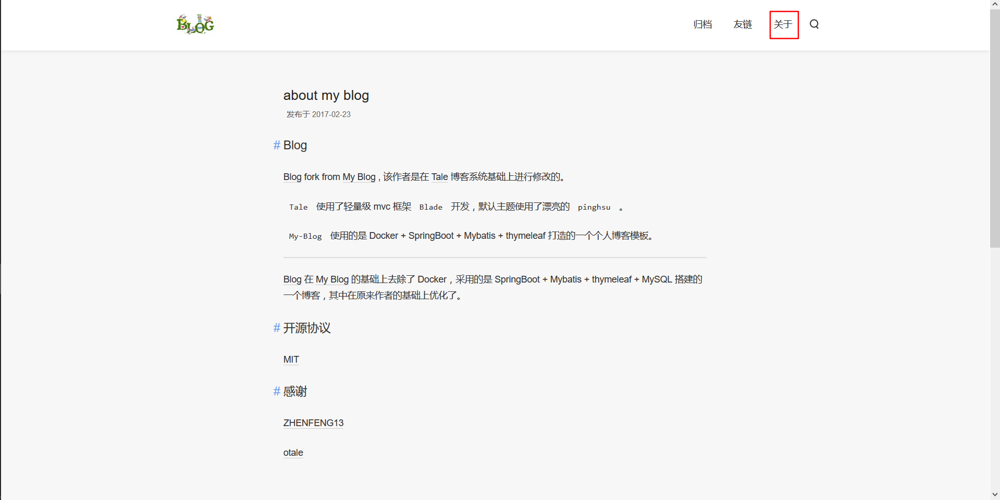
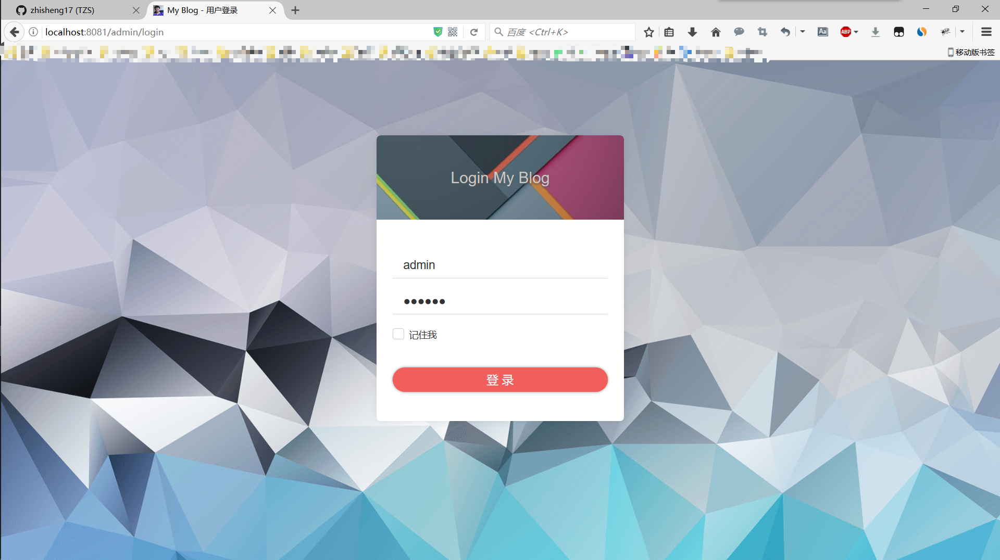
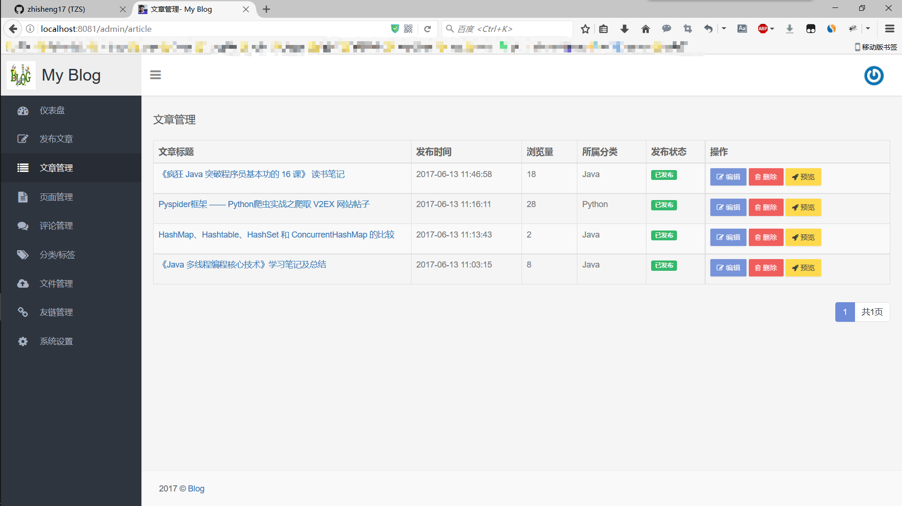
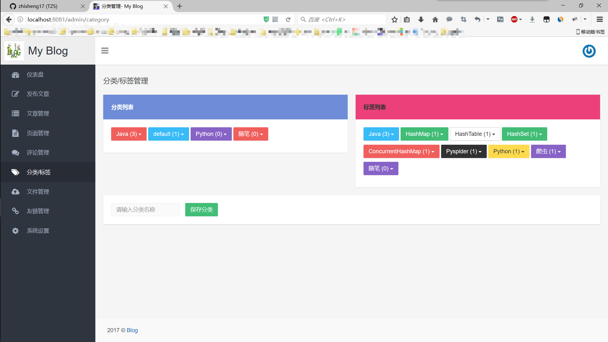

## Blog
该博客用来自我学习
原作者git地址https://github.com/zhisheng17/blog.git

## 功能如下：

 博客首页：
 

 归档：
 

 友链：
 
 
 关于：
 
 
 搜索：
 
 
 **后台管理**
 
 管理登录：
 
 
 管理首页：
 
 
 发布文章：
 
 
 文章管理：
 
 
 页面管理：
 
 
 分类标签：
 
 
 文件管理：
 
  
 友链管理：
 
   
 系统设置：
 
 
## 开源协议

[MIT](./LICENSE)

## 感谢

[ZHENFENG13](https://github.com/ZHENFENG13)
[otale](https://github.com/otale)
